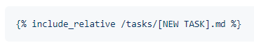
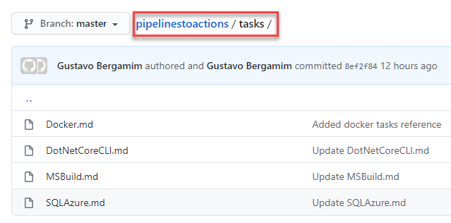

# Azure Pipelines to GitHub Actions

Use this guidance to rewrite Azure Pipelines (Build and Release Tasks) on GitHub Actions.

## Table of contents
---
<!--ts-->
   * Tasks/Actions
     * [`MSBuild`](#msbuild)
     * [`DotNetCore`](#dotnetcore)
     * [`Azure SQL`](#azure-sql)
     * [`Docker`](#docker)
     * [`Version JSON File`](#version-json-file)
     * [`Azure Web App`](#azure-web-app)
   * [`References`](#references)
   * [`Contribute`](#contribute)
<!--te-->

---

## MSBuild


## DotNetCore


## Azure SQL


## Docker


## Version JSON File


## Azure Web App


---

## References

- Links
  - [GitHub Actions](https://github.com/features/actions)
  - [GitHub Markeplace](https://github.com/marketplace?type=actions)
- Posts
  - [GitHub Actions Advent Calendar](https://www.edwardthomson.com/blog/github_actions_advent_calendar.html)
  - [Converting my Azure DevOps Tasks to GitHub Actions](https://blogs.blackmarble.co.uk/rfennell/2019/09/10/a-first-look-at-github-action-converting-my-azure-devops-tasks-to-github-actions/)
- Video Tutorials
  - [A first look at GitHub Actions & converting my Azure DevOps Tasks to GitHub Actions](https://www.youtube.com/watch?v=e_F_4OB9Mg4&t=1627s)

## Contribute

Contributions to **Pipelines to GitHub Actions** are welcome. Please fork this repo.

- Include on `ReadMe.md` a respective task/action that you want to document (`Table of contents` section and link to task markdown).
  - Table of contents
  
   

   

  - Link to task/action markdown
  
   

- Create new markdown file under `Tasks` folder and describe Azure Pipeline Tasks and respetive GitHub Actions. Use as an example [DotNetCore](/tasks/DotNetCoreCLI.md).

